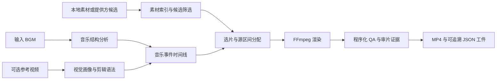

# BGM Montage

> 面向节奏混剪的可追溯音乐驱动视频编排与渲染工具。

[](https://github.com/sharbvane/bgm-montage/releases)
[](https://www.python.org/downloads/release/python-3110/)
[](LICENSE)
[](https://ffmpeg.org/)

`bgm-montage` 会从音乐的节拍、重拍、乐句、段落与能量变化中生成剪辑节奏，再结合本地素材、参考视频或素材提供方候选，完成选片、时间线规划、渲染与质量检查。它的重点不是“随机拼接”，而是让每一个镜头、来源区间、切点和检查结果都能被追溯。

当前核心版本为 **v1.4.6**。独立的极速卡点 Windows 安装版见 [BMTS Lite v0.1.1 Release](https://github.com/sharbvane/bgm-montage/releases/tag/v0.1.1-lite)。

## 它能做什么

| 能力 | 说明 |
| --- | --- |
| 音乐结构分析 | 分析 BPM、节拍/重拍、onset、能量、乐句、段落、停顿、drop、surge 与高潮。 |
| 节奏时间线 | 在下载和渲染前生成 `timeline.json`，镜头切点优先贴合真实音乐事件。 |
| 参考风格学习 | 从只读参考视频提取视觉风格与剪辑语法，影响镜头长度、运动、景别和转场偏好。 |
| 多种素材来源 | 支持 YouTube-first、Pixabay、已审素材清单，以及完全离线的 Local Library。 |
| 本地素材索引 | 为本地素材库维护轻量视觉索引；未变化素材复用结果，只有 Top-K 候选进入深度分析。 |
| 可控选片 | 控制来源复用、累计画面占比、重复间隔、可用源区间、相邻镜头多样性和连续性。 |
| 渲染与验收 | 通过 FFmpeg 渲染 H.264/AAC 成片，执行媒体、节奏、黑帧、冻结、静音、裁剪与序列 QA。 |
| 可编辑交付 | 可选从同一份 `edit_decisions.json` 导出剪映专业版草稿。 |

## 适合的场景

- 已有一批本地视频素材，需要根据音乐自动生成节奏混剪。
- 想将参考视频的节奏与镜头语言转化为可检查的剪辑策略。
- 需要保留素材来源、源时间段、时间线、渲染报告和审片证据的研究或制作流程。
- 需要在不修改原始素材库的前提下，对本地素材进行持续复用和自动选片。

## 工作流程



## 快速开始

### 运行环境

- Windows 11 x64 上已验证 **CPython 3.11.9**；建议使用 Python 3.11。
- 系统 `PATH` 中需要有 `ffmpeg` 与 `ffprobe`。
- 核心依赖锁定在 [requirements.lock.txt](requirements.lock.txt)；基础依赖范围见 [requirements.txt](requirements.txt)。
- 使用 YouTube 获取素材时需要 `yt-dlp`，它已在锁定依赖中。
- 使用 Pixabay 时，需要在本地 `.env` 或环境变量中配置 `PIXABAY_API_KEY`。

```powershell
git clone https://github.com/sharbvane/bgm-montage.git
Set-Location bgm-montage
py -3.11 -m venv .venv
.\.venv\Scripts\python -m pip install --upgrade pip
.\.venv\Scripts\python -m pip install -r requirements.lock.txt
.\.venv\Scripts\python -m pip check
ffmpeg -version
ffprobe -version
```

Local Library 模式完全离线，不需要 API Key。以下命令以本地视频库为例，`--agent-visual-review off` 适合无人值守的本地试跑；正式流程默认要求视觉审片证据。

```powershell
$Python = ".\.venv\Scripts\python.exe"

& $Python .\scripts\bgm_montage.py `
  --source-provider local-library `
  --local-library-dir "E:\media\landscape" `
  --bgm "E:\music\track.mp3" `
  --theme "冰岛冰川、瀑布与火山" `
  --duration 30 `
  --ratio 9:16 `
  --output-dir "E:\renders" `
  --agent-visual-review off
```

运行前可先确认可用参数：

```powershell
& $Python .\scripts\bgm_montage.py --version
& $Python .\scripts\bgm_montage.py --help
```

## 素材来源与基本用法

| 模式 | 适用情况 | 关键参数 |
| --- | --- | --- |
| `local-library` | 使用本地视频库；不联网获取素材。 | `--source-provider local-library --local-library-dir PATH` |
| `youtube-first` | 默认策略；先检索与复用 YouTube 候选，不足时可回退。 | `--source-provider youtube-first` |
| `youtube` | 只走 YouTube 获取流程。 | `--source-provider youtube` |
| `pixabay` | 使用 Pixabay 候选池。 | `--source-provider pixabay` 与本地 `PIXABAY_API_KEY` |
| 已审素材清单 | 跳过素材获取，保留时间线、选片、渲染和 QA。 | `--asset-manifest PATH` |

完整参数、断点续跑、素材排除、显式 YouTube 源区间、剪映草稿和提供方策略见 [使用说明](references/usage.md)。

## 输出与可追溯性

成功运行会写入独立的 `<output-dir>/<project-slug>/<run-id>/`，默认不会覆盖历史结果。常见工件如下：

```text
<run-id>/
├── <project>_montage.mp4       # 最终 H.264/AAC 成片
├── audiomap.json               # BGM 结构分析真值
├── timeline.json               # 音乐事件驱动的镜头槽位
├── asset_manifest.json         # 候选、来源、缓存与实际使用区间
├── edit_decisions.json         # 统一时间线和逐镜编辑决策
├── render_report.json          # 媒体、节奏与序列 QA 报告
├── run_state.json              # 断点续跑输入摘要
├── run_report.json             # 阶段状态与产物路径
└── attempts/                   # 每次选片、渲染与 QA 尝试的证据
```

提供参考视频时，还会生成 `style_profile.json` 与 `editing_grammar.json`；开启视觉审片时，会额外保留 `agent_visual_review_request.json`、`agent_visual_review.json` 及检查帧证据。

## 项目结构

```text
.
├── scripts/                 # 音乐分析、选片、渲染、QA 与导出入口
├── tests/                   # 回归、离线 E2E、时间线与渲染 QA 测试
├── references/usage.md      # 完整使用说明
├── agents/openai.yaml       # Agent 集成配置
├── SKILL.md                 # Skill 工作流说明
├── requirements*.txt        # 基础、锁定与剪映可选依赖
├── CHANGELOG.md             # 版本变更记录
└── TEST_REPORT.md           # 已记录的验证结果
```

## 验证与质量

```powershell
.\.venv\Scripts\python -m pytest
```

测试覆盖音乐结构、时间线、离线端到端流程、本地素材库、素材使用策略、渲染 QA、引用风格、打包与来源提供方流程。详细历史和验证范围见 [TEST_REPORT.md](TEST_REPORT.md) 与 [CHANGELOG.md](CHANGELOG.md)。

## Release

- [v1.4.6](https://github.com/sharbvane/bgm-montage/releases/tag/v1.4.6)：当前核心发布版本。
- [BMTS Lite v0.1.1](https://github.com/sharbvane/bgm-montage/releases/tag/v0.1.1-lite)：面向极速卡点混剪的独立 Windows 安装版。

仓库不提交用户素材、缓存、日志、凭据、虚拟环境或测试输出。下载前请阅读对应 Release 的说明和校验信息。

## 贡献与反馈

欢迎提交可复现的缺陷报告、文档修正和测试改进。提交前请阅读 [CONTRIBUTING.md](CONTRIBUTING.md)，并避免提交媒体、缓存、`test-output`、`.env` 或任何凭据。

安全问题请按 [SECURITY.md](SECURITY.md) 中的方式私下报告，不要在公开 Issue 中暴露凭据或可利用细节。

## 许可证

本项目采用 [Source-Available Non-Commercial License](LICENSE)，允许本地学习、研究、测试和非商业技术交流。它不是 MIT、Apache-2.0、GPL 或其他商业宽松开源许可证。商业使用、商业分发或集成到商业产品/服务前，请联系 `thiscui@foxmail.com` 获得书面许可。详见 [LICENSE-NOTICE.md](LICENSE-NOTICE.md)。
